# HTML 笔记

## 标签之标题

### 一、标题标签（h）

通过h1到h6定义

```html
<h1></h1>
<h2></h2>
<h3></h3>
<h4></h4>
<h5></h5>
<h6></h6>
```

快捷生成六个标题的方法：

```html
h$*6(回车)
```

### 二、控制位置

```html
align="left|center|right"
```

```html
<h1 align="left"> </h1>
<h2 align="center"> </h2>
<h3 align="right"> </h3>
```

## 标签之段落、换行、水平线

### 一、段落标签：（p）

```html
<p>这是一段段落标签</p>
<p>这是另一段段落标签</p>
```

**效果展示：**


### 二、换行标签：（br）

```html
<p>这是一个段落<br>这是另外一个段落</p>
```

**效果展示：**


### 三、水平线标签：（hr）

```html
<hr color="颜色" width="水平线长度" size="高度" align="位置"(默认居中，可以设置左右)>
<hr>
```

**效果展示：**


## 标签之图片

### 一、图片标签：（img）

```html

```

### 二、示例

```html


```

**显示效果：**


### 三、图片的路径详解（绝对路径、相对路径、网络路径）

#### 一、绝对路径

**定义：绝对路径是电脑的盘符存储与访问的具体地址**

```html

```

父级：图片在html的上一级


#### 网络路径：（图片出现的会很慢）

```html

```

## 标签之超文本链接（a）

### 一、超文本标签

```html
<a href="url(全部网址)">链接文本</a>
```

### 二、示例

```html
<a href="https://www.baidu.com/?tn=68018901_2_oem_dg">
      
      百度一下
    </a>
```

效果：（点击图片或者文字后可跳转)


默认没点过呈现蓝色，点过呈现紫色，点击时变成红色


## 标签之文本

### 一、标签之文本

| 标签         |       描述       |
| ------------ | :--------------: |
| `<em>`     |   定义着重文字   |
| `<b>`      |   定义粗体文本   |
| `<i>`      |    定义斜体字    |
| `<del>`    |    定义删除字    |
| `<span>`   | 元素没有特定含义 |
| `<strong>` |   定义加重语气   |

### 二、示例

```html
   <span>白菜</span>
    <em>白菜</em>
    <i>白菜</i>
    <b>白菜</b>
    <strong>白菜</strong>
    <del>白菜</del>
```


## 列表标签之有序列表

### 一、有序列表

有序列表始于 `<ol>`标签，每个列表项始于 `<li>`标签 ，`<li>`标签里可以接着嵌套 `<ol>`标签，可以用type更改属性


### 二、示例

```html
<ol>
    <li>吃饭</li>
    <li>睡觉</li>
    <li>打豆豆</li>
</ol>
```


## 列表标签之无序列表

### 一、无序列表（ul)

无序列表用小黑圆点进行标记,，也可用type调整属性


### 二、示例

```html
<ul type="circle">
      <li>吃饭</li>
      <li>睡觉</li>
      <li>打豆豆</li>
</ul>
```

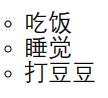

**网站导航常使用无序列表！**


### 三、快捷键

```html
ul>li*3
快速生成：
<ul>
      <li></li>
      <li></li>
      <li></li>
</ul>
```

## 标签之表格

### 一、表格标签

表格：`<table>`

行：`<tr>`

列：`<td>`

常用属性：

| 属性   | 作用 |
| ------ | ---- |
| border | 边框 |
| width  | 宽度 |
| height | 高度 |

### 二、示例

快捷键：table>tr*2>td\*3{文本信息}

```html
<table border="2" height="20" width="100">
      <tr>
        <td>1</td>
        <td>2</td>
        <td>3</td>
      </tr>
      <tr>
        <td>4</td>
        <td>5</td>
        <td>6</td>
      </tr>
</table>
```


```html
 <table>
      <tr>
        <td>你好</td>
        <td>你好</td>
      </tr>
      <tr>
        <td>你好</td>
        <td>你好</td>
      </tr>
      <tr>
        <td>你好</td>
        <td>你好</td>
      </tr>
</table>
```


## 表格单元格合并

### 一、表格合并

**水平合并：colspan**

**垂直合并：rowspan**

### 二、示例

```html
<table border="2" width="400" height="200">
      <tr>
        <td>文本</td>
        <td colspan="2">文本</td>
  
        <td>文本</td>
        <td>文本</td>
        <td>文本</td>
      </tr>
      <tr>
        <td rowspan="2">文本</td>
        <td>文本</td>
        <td>文本</td>
        <td>文本</td>
        <td>文本</td>
        <td>文本</td>
      </tr>
      <tr>
  
        <td>文本</td>
        <td>文本</td>
        <td>文本</td>
        <td>文本</td>
        <td>文本</td>
      </tr>
    </table>
```


## Form表单

### 一、介绍

* **在Web网页中用来给用户填写信息，从而能采集用户信息，*使网页具有交互功能***
* **所有的用户输入内容都用表单来写，如*登录注册，搜素框***
* **表单由容器和控件组成，一个表单一般应该包含用户填写信息的输入框，提交按钮等等**
* **输入框，提交按钮等就是*控件*，表单就是*容器*，它能够容纳各种各样的控件**

### 二、形式：

```html
<form action="url" method="get|post" name="myform"></form>
```

| 属性   | 说明                                    |
| ------ | --------------------------------------- |
| action | 服务器地址                              |
| name   | 表单名称                                |
| get    | 提交的数据url可以看到，用于提交少量数据 |
| post   | url看不到，用于提交大量数据             |

### 三、表单元素（表单标签、表单域、表单按钮）

```html
<form>
      <input type="text">
      <input type="submit">
</form>
```

**显示：**


## 表单元素

### 一、文本框

文本域通过 `<input type="text">`标签来设定，当用户要输入的时候就会用到

```html
<form>
      账号：<input type="text" >
      <br>
      密码：<input type="text">
</form>
```


### 二、密码框

密码字段通过标签 `<input type="password">`来定义

```html
<form>
      密码：<input type="password">
</form>
```


### 三、提交按钮

* **当用户单击确认按钮时，表单的内容会被传送到另一个文件。**
* **表单的动作属性定义了目的文件的文件名。**
* **由动作属性定义的文件会对接收的数据进行处理。**

***（说人话就是放一个按钮在这，按一下就可以把数据提交给服务器）***

```html
<form>
      密码：
      <input type="password" name="mima" placeholder="请输入你的密码">
      <input type="submit" value="确定">
</form>
```


### 块元素与行内元素

|             块元素             |           内联元素           |
| :----------------------------: | :--------------------------: |
|       会在页面中独占一行       | 不会独占一行，只占自身的大小 |
|     可以设置width，height     |   不可以设置width，height   |
| 可以包含行内元素和其他块级元素 |  包含内联元素不包含块级元素  |

**常见的块级元素：**

* **div、form、h1~h6、hr、p、table、ul…**

**常见的内联元素**

* **a、b、em、i、span、strong…**

**行内块级元素（特点：不换行、能够识别宽高）**

* **button、img、input…**

## 容器元素（div），html5新增标签

### 一、常见的页面布局：


### 二、传统写法：

```html
    <div id="header"></div>
    <div id="nav"></div>
    <div id="article">
      <div id="section"></div>
    </div>
    <div id="silder"></div>
    <div id="footer"></div>
```

### 三、使用新增标签(更优写法)（在老版本浏览器无法运行）

```html
    <header></header>
    <nav></nav>
    <article>
      <section></section>
    </article>
    <aside></aside>
    <footer></footer>
```

| 标签                    | 介绍                                 |
| ----------------------- | ------------------------------------ |
| `<header></header>`   | 头部                                 |
| `<nav></nav>`         | 导航                                 |
| `<article></article>` | 代表一个独立完整的内容块             |
| `<section></section>` | 定义文档中的节，比如章节、页眉、页脚 |
| `<aside></aside>`     | 侧边栏                               |
| `<footer></footer>`   | 脚部                                 |

# CSS——网页的医美

## CSS介绍

### 一、语法（选择器＋样式）

### 二、示例

```html
<style>
      h1{
        color: blue;
        font-size: 30px;
      }
</style>
<h1>你好!</h1>
```


## CSS的引入方式

### 一、内联样式

#### 1、示例

```html
<p style="color: blue; font-size: 30px;">笑出强大</p>
```


#### 2、缺点

*缺乏整体性和规划性，不利于维护、维护成本高*

### 二、内部样式

***在 `<head>`标签里添加样式，可对所有的同类型标签生效***

#### 1、示例

```html
<head>
<style>
      h1{
        color: blue;
        font-size: 30px;
      }
</style>
</head>
<body>
	<h1>你好</h1>
	<h1>世界</h1>
</body>
```


#### 2、特点

***单个页面内的css代买具有统一性和规划性，便于维护，但在多个页面之间容易混乱***

### 三、外部样式

```html
<link rel="stylesheet" type="text/css" href="xxx.css">
```

## 选择器

### 一、全局选择器

***可以与任何元素匹配，优先级最低，一般做样式初始化***

```html
   <style>
      *{
        font-size: 30px;
        color: red;
      }
   </style>
  <p>你好！</p>
  <h1>世界</h1>
  <em>hello world!</em>
```


### 二、元素选择器

```html
<style>
      h1{
        color: blue;
        font-size: 30px;
      }
</style>
```

### 三、类选择器

```html
<h2 class="oneclass size">你好</h2>
  <style>
    .oneclass{
    color: red;
  }
    .size{
	font-size=30px;
}
  </style>
```

### 四、ID选择器

```html
<h2 id="text">你好</h2>
  <style>
    #text{
      color:red;
      font-size: 50px;
    }
  </style>
```

***针对某一个特定的标签来使用，只能使用一次。css中的ID选择器以#来定义。***

### 五、合并选择器

**语法：选择器1，选择器2...{}**

***作用：提取共同的样式，减少重复代码***

```html
  <style>
    p,h3{
      color: red;
      font-size: 30px;
    }
   </style>
  <p>nihao</p>
  <h3>world</h3>
```


### 六、优先级

***行内样式>ID选择器>类选择器>元素选择器***

```html
<style>
    .t1{
      color: red;
      font-size: 30px;
    }
    .t2{
      color: green;
    }
  </style>
  <p class="t1 t2">nihao</p>
```


***字会变大(按t1)，颜色会变绿(按t2)，类选择器，后面的类会把前面的类覆盖***

***（先后指的是style里创建的先后，与class里的先后无关）***

## 字体属性

### 一、color

```html
<style>
    p{
      color:red;
      color:#0000ff;
      color:rgb(0,0,0);
      color:rgba(50,200,255,0.7);
    }
```

 **（****rgba，a是透明度）**

### 二、字体大小(font-size)

***chrome浏览器接受的最小字体是12px***

### 三、文本粗细(font-weight)

|        值        | 描述                                               |
| :---------------: | -------------------------------------------------- |
|  **bold**  | **定义粗体字符**                             |
| **bolder** | **定义更粗字符**                             |
| **lighter** | **定义更细字符**                             |
| **100~900** | **定义由细到粗，400等同默认，700等同于bold** |

```html
p{font-weight:normal;}
p{font-weight:bold;}
p{font-weight:900;}
```

### 四、字体样式（font-style)

| 值               | 描述             |
| ---------------- | ---------------- |
| **normal** | **默认值** |
| **italic** | **斜体**   |

### 五、指定元素字体(font-family)

```html
font-family:"微软雅黑"
```

## 背景属性

### 一、简介

| 属性                          | 描述                   |
| :---------------------------- | ---------------------- |
| **background-color**    | **设置颜色**     |
| **background-image**    | **设置图片**     |
| **background-position** | **设置显示位置** |
| **background-repeat**   | **设置如何填充** |
| **background-size**     | **设置大小属性** |

#### 1、background-color

```html
<style>
  .box1{
    width: 100px;
    height: 100px;
    background-color: red;
  }
</style>
```


#### 2、background-image

```html
 .box1{
    width: 1200px;
    height: 600px;
    background-image: url(baidu.png);
  }
```


#### 3、background-repeat


```html
 .box1{
    width: 1200px;
    height: 600px;
    background-image: url(baidu.png);
    background-repeat:repeat-x;
  }
```

##### 一.repeat-x


##### 二.repeat-y


##### 三.no-repeat


#### 4、background-size


##### 一.length

```html
<style>
  .box1{
    width: 1200px;
    height: 600px;
    background-size: 1200px 300px;
  }
</style>
```


***background-size会改变图片的大小（拉伸图片），width，height不改变图片大小***

##### 二.percentage

```html
background-size: 100% 100%;
```


##### 三.cover(比例不变)

```html
background-size: cover;
```

***在比例不变的情况下充满全屏***

##### 四.contain

```html
background-size: contain;
```

***在不损失图片的情况下，尽可能的充满全屏***

#### 5、background-position

***设置背景图片的起始位置，默认值是0% 0%***


## 文本属性

### 1、text-align:位置


2、text-decorationL:划线


### 2、text-transform:大小写


### 3、text-indent:首行缩进


## 边框

### 一、表格边框


### 二、折叠边框


### 三、宽高


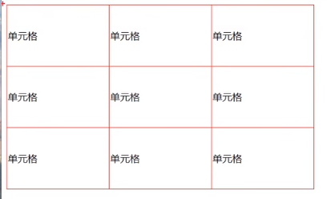

### 四、文字对齐

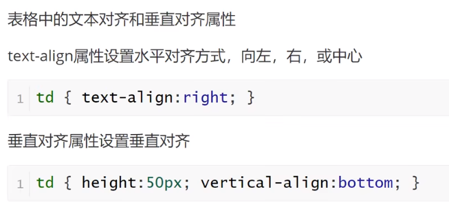

### 五、表格填充


### 六、表格颜色


## 关系选择器

### 一、后代选择器

```
E I{
   样式
}(I是E下的标签，只要I在E内，就有效)
```

```html
  <style>
    ul li{
      color:red;
    }
  </style>

  <ul>
    <li>列表1</li>
    <li>列表2</li>
    <li>列表3</li>
  </ul>
```


### 二、子代选择器

***选择所有作为E元素的直接子元素F，对更深一层的元素不起作用，用>表示***

```html
E>F{}
```

```html
<div>
	<a href="#">子元素1</a>
	<p><a href="#">孙元素1</a></p>
	<a href="#">子元素2</a>
</div>
<style>
	div>a{
		color:red;
	}
</style>
```


### 三、相邻兄弟选择器

***选择紧跟E元素后的F元素，用加号表示，选择相邻的第一个兄弟元素(往下相邻第一个)***

```html
E+F{}
```

```html
<h1>h1元素</h1>
<p>第一个元素<p>
<p>第二个元素</P>
<style>
	h1+p{
		color:red;
	}
</style>
```


### 通用兄弟选择器

***选择E元素之后的所有兄弟元素F，作用于多个元素，用~隔开，只能向下选择***

```html
E~F{}
```

```html
<h1>h1元素</h1>
<p>第一个元素</p>
<div>哈哈哈哈</div>
<p>第二个元素</p>
```


## CSS盒子模型（Box Model）

### 一、概念


### 二、示例

```html
<style>
    #nihao{
      height: 100px;
      width: 100px;
      background-color: aqua;
      padding: 20px 20px;
      border: 10px solid black;
      margin: 60px 30px;
    }

  </style>
 <div id="nihao">
    11111111
    11111111
    11111111
    11111111
 </div>
```


## 弹性盒模型(flex box)

***作用：设置盒子里的盒子之间的位置***

`<html>`**：****创建一个大盒子里面装4个小盒子**

```html
  <body>
    <div class="container">
      <div class="item1"> 

      </div>
      <div class="item2"> 

      </div>
      <div class="item3">
  
      </div>
      <div class="item4">
  
      </div>
    </div>
```

`<css>`

```css
.container{
    width:100px;
    height: 100px;
    background-color: rgb(200, 200, 200);
}
.item1{
    width: 25px;
    height: 25px;
    background-color:blue;
}
.item2{
    width: 25px;
    height: 25px;
    background-color: red;
}
.item3{
    width: 25px;
    height: 25px;
    background-color: green;
}
.item4{
    width: 25px;
    height: 25px;
    background-color: yellow;
}
```

***（创建出来之后默认从上到下排列，现在要调整小盒子之间的位置就要使用flex-box）***

### 一、设置

```css
.container{
    width:100px;
    height: 100px;
    background-color: rgb(200, 200, 200);
    display: flex;
}
```

***使用display:flex，默认盒子横向摆放***


### 二、父盒子属性

#### 1、flex-direction：

**row，row-reverse，column，column-reverse，*就是将调节讲盒子横(竖)向摆放***

#### 2、justify-content：

**flex-end,flex-start,center，就是把盒子在纵向上靠上(中、下)摆放**


#### 3、align-items属性

**flex-end,flex-start,center，就是把盒子在横向上靠上(中、下)摆放**

***(justify-content和align-items的center属性一起使用可以让小盒子在大盒子居正中)***

### 三、子盒子属性

#### 1、flex

***小盒子摆放时占大盒子长（宽）的比例***

如果是纵向摆放：

```css
.item1{
    background-color:blue;
    flex: 1;
}
.item2{
    background-color: red;
    flex: 2;
}
.item3{
    background-color: green;
    flex: 3;
}
.item4{
    background-color: yellow;
    flex: 4;
}
```

***(大盒子大小改变，小盒子大小也会改变，盒子长度不变)***

## 文档流

### 一、脱离文档流

* **浮动**
* **绝对定位**
* **固定定位**

#### 1、浮动（相当于在一层画布上再盖一层画布）

***用float属性来定义元素在哪个方向浮动，任何元素都可以浮动***

**left：元素向左浮动
right：向右浮动**

```html
   <div class="box">

   </div>
   <div class="container">

   </div>
```

##### 1.未浮动

```css
 	.box{
        width: 100px;
        height: 100px;
        background-color: aqua;
      }

      .container{
        width: 200px;
        height: 100px;
        background-color: blue;
      }
```

(创建两个盒子上下摆放)（默认是上下摆放）


##### 2.左浮动

```css
.box{
        width: 100px;
        height: 100px;
        background-color: aqua;
	float:left;	//添加float:left就相当于在在画布上再加一层画布，覆盖了原画布
      }
```


##### 3.右浮动

```css
.box{
        width: 100px;
        height: 100px;
        background-color: aqua;
	float:right;	//右浮动
      }
```


#### 二、清除浮动

##### 1.浮动的副作用

* **会造成父元素高度塌陷**
* **后续元素会受到影响**

（*像这样后续元素会被浮动元素遮挡）*

##### 2.清除浮动的方法

* **父元素设置高度**
* **受影响的元素增加clear属性**
* **overflow清除浮动**
* **伪对象方式**

###### I.父元素设置高度

```html
height:500px
```

###### II.添加clear属性

***clear：left\right\both***

**清除左浮动、右浮动、都清除**

```css
.text{
        width: 200px;
        height: 150px;
        background-color: red;
        clear: both;
      }
```

*(添加clear后，后续元素可以默认浮动元素占了位置)*

###### III.overflow清除浮动

***在父级元素无法设置固定高度时（高度是动态的），就要用到overflow设置高度***

###### IV.伪对象设置方式

***添加前：***


```css
.container{
        width: 500px;
        background-color: #888;
      }
 .container::after{
        content: "";
        display: block;
        clear: both;
      }
```

***在父元素后添加这些代码,浮动元素就会把父元素撑开并占一定的空间***


## 定位

**position属性指定了元素的定位类型**

| 值                 | 描述               |
| ------------------ | ------------------ |
| **relative** | **相对定位** |
| **absolute** | **绝对定位** |
| **fixed**    | **固定定位** |

***使用定位后可以使用四个方向值来进行位置调整left、top、right、bottom***

### 一、相对定位(不脱离文档流)

```html
<div class="box"></div>
```

```css
.box{
        width: 200px;
        height: 200px;
        background-color: red;
        position: relative;
	left:100px;
	top:100px;
}
```


### 二、绝对定位（脱离文档流）

***用法与相对定位类似，但是绝对定位的元素可以脱离文档流，覆盖在别的元素上***

***绝对定位每设置一个就多一层，所以可以出现层层覆盖的效果 ，但浮动只有两层，所有浮动在一层***


### 三、固定定位（脱离文档流）

用法类似，应用场景较少，一般应用于无论怎么滚动页面位置不变的元素

***（像页面左下角的这种）***

### 四、注意


### 五、Z-index

***用来设置堆叠顺序，堆叠顺序越高，元素排在越前面***

```html
<div class="box1"></div>
<div class="box2"></div>
```

```css
.box1{
        width: 200px;
        height: 200px;
        background-color: red;
        position:absolute;
        left: 100px;
        top: 100px;
      }
.box2{
        width: 100px;
        height: 100px;
        background-color: blue;
        position:absolute;
        left: 100px;
        top: 100px;
      }
```


**目标：让红色覆盖蓝色**

```css
.box1{
	z-index:100;
}
.box1{
	z-index:50;
}
```


## CSS3新特性

### 一、设置圆角(border-radius)


***（一个值：100px(或者50%)时就是个圆）***

### 二、阴影（box-shadow)


```html
<div class="box1"></div>
```

```css
.box1{
        width: 200px;
        height: 200px;
        background-color: rgb(59, 209, 232);
        position:absolute;
        left: 100px;
        top: 100px;
        box-shadow: 30px 30px blue;
      }
```


## 动画

### 一、使用@keyframes创建动画

```css
@keyframes name{
        from|0%{

        }
        percent{

        }
        to|100%{

        }
} 
```

***name：动画名称，开发人员自己命名
percent：为百分比值，可以添加多个百分比值***

### 二、animation执行动画

```css
animation:name duration timing-function delay iteration-count direction;
```


### 二、触发

```css
.box1:hover{
        background-color: aqua;
}
```

***鼠标悬浮后变成青色***

## 媒体查询

### 一、meta标签


### 二、媒体查询语法

```css
@media screen and (max-width:768px){

}
@media screen and (min-width:768px) and (max-width:996px){
  
}
@media screen and (min-width:996px){

}
```

***通过上述语法可以控制在不同屏幕大小下显示的内容***

### 三、示例

```html
 <body>
    <div class="box"></div>
</body>
```

```css
 .box{
        width: 300px;
        height: 300px;
      }
      @media screen and (max-width:768px){
        .box{
          background-color: aqua;
        }
      }
      @media screen and (min-width:768px) and (max-width:996px){
        .box{
          background-color: green;
        } 
      }
      @media screen and (min-width:996px){
        .box{
          background-color: red;
      }
```

***上述代码可以控制在不同屏幕大小下，div显示的背景颜色***

## CSS Sprite（精灵图、雪碧图）

### 一、概念


### 二、应用


***我现在有一张图，而我只想显示特定的表情，比如第二排第三个那个流泪的表情***

```html
<span class="icon1"></span>
```

```css
.icon1{
        display: block;
        width: 55px;
        height: 55px;
        background-image: url(1.jpg);
        border: 1px solid red;
        background-position: -185px -88px;
      }
```

***我可以通过调整Background-position来调整显示图片的位置***


***通过在浏览器的控制台（F12）中调节位置***

（***可以精准显示图片）***

## 字体图标

### 一、定义

**像这种的就是字体图标，看起来像图，但可以当做字体去调节：**


### 二、使用方式


阿里字体图标库链接：[iconfont-阿里巴巴矢量图标库](https://www.iconfont.cn/?spm=a313x.7781069.1998910419.d4d0a486a)

选择字体加入购物车，下载代码


下载下来后，解压压缩包，点击：


点击：


复制代码：


添加到 `<head>`标签中

赋值代码，


添加到 `<body>`中：

页面上就会生成字体图标

### 三、CSS调节

```html
<body>
    <span class="iconfont icon-shouye home"></span>
</body>
```

```css
.home{
        font-size: 40px;
        color: red;
      }
```


# JavaScript

## JS语句、标识符

### 一、定义变量

```html
<script>
	var num = 10;
</script>
```

### 二、打印

#### 1、console.log()

在控制台打印

```html
<script>
	console.log(num)
</script>
```


#### 2、alert()

```html
<script>
	alert("你好")
</script>
```


### 3、document.write()

```html
<script>
      document.write("你好");
</script>
```


## JS引入到文件

* **嵌入到HTML文件中**
* **引入本地独立js文件**
* **引入网络来源文件**

### 一、嵌入到HTML文件中

创建 `<script>`标签，在里面写代码

### 二、引入本地独立js文件

```html
<script src="./hello.js"></script>
```

### 三、引入网络来源文件

```html
<script src="网址"></script>
```

## 数据类型

    **原始数据类型：**

* 数值
* 字符串
* 布尔值
  **合成数据类型：**
* 对象
  **特殊值：**
* null
* undefined

**ES6新增：**

* Symbol
* Biglnt

### 一、原始数据类型

```html
<script>
      var age = 10;
      var name = "zhangsan"
      var flag = true;
      var flag1 = false;
</script>
```

### 二、合成数据类型

```html
<script>
     var user={
        age:18,
        name = "iwen",
        hunyin:true,
      }
</script>
```

### 三、特殊值(代表无\\空)

```html
<script>
  var hello = null;
  var world = undefined;
</script>
```

## typeof运算符

**作用：判断基本数据类型**

```html
<script>
      var age = 20;
      console.log(typeof age);
</script>
```


**typeof不适合用来判断object类型**

## 比较运算符

|  比较运算符  | 作用                       |
| :-----------: | -------------------------- |
| **==** | **相等运算符**       |
| **===** | **严格相等运算符**   |
| **!=** | **不相等运算符**     |
| **!==** | **严格不相等运算符** |

举个例子：

```js
var num1 = 10;
var num2 = "10";
console.log(num1 == num2);
console.log(num1 === num2);
```

==会返回true，===会返回false

**前者只比较数值，后者既比较数值，也比较类型**

## 布尔运算符

* **&&且运算**
* **||或运算**
* **！取反运算**


**取反运算符只有以上6个为true**

## 字符串

### 一、引号的使用

**单(双)引号里面嵌套单(双)引号需要在里面的引号前加反斜杠**\

### 二、获取字符串长度（.length）

**用法：**

**console.log(str1.length)**

### 三、字符串方法_charAt()

**作用：返回指定位置的字符，参数从0开始编号**

**用法：**

**console.log(str1.charAt(1));**

***如果传入参数长度过大或者过小，charAt返回空字符串""***

### 四、字符串方法_concat()

**作用：连接多个字符串,不改变原字符串**

```js
var s1="111";
var s2="222";
var s3="333";
var num=100;

s1.concat(s2,s3,num);//会把100转换成字符串
s1
```

```js
var result=s1+s2+s3+num;	 //是等效的
```

### 五、sub_string()

**用于从源字符串取出子字符串并返回，不改变原字符串，第一个参数表示字符串开始位置，第二个参数表示字符串结束位置**

举例：

```js
'12345'.substring(0,2);
```

***如果第一个参数大于第二个参数，substring会自动更换两参数位置，如果参数为负数，会自动转为0，第二个参数不写默认到结尾***

### 六、substr()

***跟substring很像，第一个参数表示开始的位置，第二个参数表示想截取的长度，如果不填第二个参数默认截到最后***

### 七、indexOf()

**用于查找一个字符串在另一个字符串中第一次出现的位置，并返回参数，如果没有返回-1;**

**第二个参数表示从哪开始往后查**

举例：

```js
'hello world'.indexOf('o',2)
```

### 八、trim()

**用于去除字符串两端的空格（包括制表符、换行符、回车符），返回一个新字符串，不改变原字符串**

扩展方法：

**trimEnd()，trimStrat()分别用于去除尾部和头部的空格**

### 九、split()

**按照给定规则分割字符串，返回一个由分割出来的子字符串组成的数组**


## 数组

### 一、数组方法_Array.isArray()

**用于判读对象是否是数组，可以弥补typeof的不足，返回True、False**

### 二、push()、pop()

**push用于在数组末端添加一个元素，并返回数组长度（会改变原数组）**

**pop用于在数组末端删除一个元素，并返回删除元素**

### 三、shift()、unshift()

**shift用来删除数组的第一个元素，并返回该元素（会改变数组）**

**unshift用于在数组的一个位置添加元素，并返回长度**

### 四、join

**把数组转化成字符串**


### 五、concat

**数组合并**


**应用场景：**

**上拉加载，合并数据**

### 六、reverse()


### 七、indexOf()


**还可以接收第二个参数，表示搜索的开始位置**

## 函数

**是一段反复调用的代码块**

举例：

```js
function add('参数'){
	//代码块;
	//return x;
}
//调用函数
add();
```

## 对象

**是一组“键值对”的集合，是一种无序的复合数据集**

### 一、创建对象

```js
var user={

}
```

**里面的数据类型可以是字符串、数字、数组、函数……甚至可以是对象**

### 二、读取对象

**对象名.属性**

**举例：log(user.name)**

**如果对象里面还有对象的话，可以用多个.来调用**

### 三、Math对象

#### 1、Math.abs()

**返回绝对值**

#### 2、Math.max(),Math.min()

**返回最大值和最小值**

#### 3、Math.floor(),Math.ceil()

**向下取整、向上取整**

#### 4、Math.random()

**返回一个大于等于零但小于一的随机数**

**获取任意区间的随机数：**

```js
function fun(min,max){
	return Math.random()*(max-min)+min;
} 
```

### 四、Data对象


#### 1、Date.now()

**返回一个时间戳，即零点到截止时间点的总毫秒数，需要自行转换成有效日期**


**举例：**

```js
console.log(new Date());
console.log(new Date().getFullYear());
```


### DOM概述

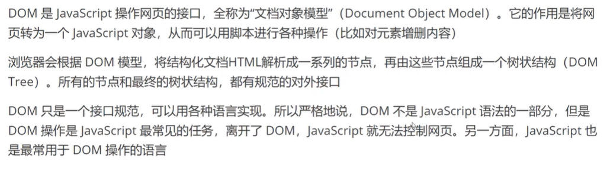

#### 1、节点


##### 节点类型：


##### 节点属性（.nodeType)：


## document对象_获取元素

### 一、document.getElementsByTagName()


### 二、document.getElementsByClassName()


### 三、document.getElementsByName()


### 四、document.getElementsById()


### 五、document.querySelector()


### 六、document.querySelectorAll()


## document对象_创建元素

### 一、document.createElement()


#### 二、document.createTextNode()

**注：appendChild()的作用是往标签里添加内容**

可以这么理解，document的方法用来创建变量，appendChild用来把不相干的变量组合到一起

### 三、document.createAttribute()


## Element_属性

### 一、Element_id


**通过以下代码，把id从“root”改为“roots”**

```html
<div class="box" id="root">Hello</div>
  <script>
    var root = document.getElementById("root");
    root.id = "roots";
  </script>
```

### 二、Element.className

**用来获取或修改对应结点的className**

```html
  <div class="box" id="root">Hello</div>
  <script>
    var root = document.getElementById("root");
    root.className = "box1"
  </script>
```

### 三、Element.classList

**这是一个集合方法**


```html
  <div class="box" id="root">Hello</div>
  <script>
    var root = document.getElementById("root");
    root.className="box box1";
    console.log(root.classList.add("mybox"));
    root.classList.remove("box");
    if(root.classList.contains("box1"))
    {
      document.write("yes!");
    }
  </script>
```

### 四、Element.innerHTML&Element.innerText

### 1、作用：都可以读取并修改结点内容

```js
var root = document.getElementById("root");
console.log(root.innerHTML = "你好");//修改内容
console.log(root.innerText = "大家好啊");//修改内容
```

#### 2、区别：前者可以识别标签，后者不行

```js
var root = document.getElementById("root");
    var str = "<a href='https://www.baidu.com'>百度</a>"
    root.innerHTML = str;
```

**(可跳转)**

```js
var root = document.getElementById("root");
    var str = "<a href='https://www.baidu.com'>百度</a>"
    root.innerText = str;
```


## Element获取元素位置


### 一、clientHeight,clientWidth

```css
 .box{
      width: 200px;
      height: 200px;
      border: 5px solid red;
      margin: 20px;
      padding: 20px;
      background-color: green;
    }
```

```js
    var box = document.getElementById("box")
	//获取指定元素的宽度和高度
    console.log(box.clientWidth);
    console.log(box.clientHeight);
  	//获取页面总高度
    console.log(document.documentElement.clientHeight);
	//获取页面内容块的总高度
    console.log(document.body.clientHeight);
```

**document.documentElement对应的元素时html**

**document.body对应的元素是body**


### 二、scrollWidth、scrollHeight

**在真实的应用场景中基本上和clientHeight,clientWidth没有区别**

### 三、scrollLeft、scrollHeight

```css
h1{
      height: 500px;
    }
```

```html
 <h1>标题</h1>
  <h1>标题</h1>
  <h1>标题</h1>
  <h1>标题</h1>
  <h1>标题</h1>

  <script>
    console.log(document.documentElement.scrollTop);
  </script>
```

**然后上下滚动页面，显示的高度值就会不断改变**

### 四、offsetHeight、offsetWidth

```css
 .box{
      font-size: 100px;
      width: 200px;
      height: 200px;
      border: 5px solid red;
      margin: 20px;
      padding: 20px;
      background-color: green;
    }
```

```html
<div class="box" id="box">你好</div>
  <script>
    var box = document.getElementById("box")
    console.log(box.offsetHeight);
    console.log(box.offsetWidth);
  </script>
```

**得到的结果是两个250（200+5*2+20\*2）**

### 四、offsetLeft、offsetTop

**到定位父级左边界和上边距的间距**

```css
  <style>
    *{
      padding: 0;
      margin: 0;
    }
    .box{
      width: 300px;
      height: 400px;
      background-color: rgb(38, 0, 255);
      margin: 50px;
    }
    .box1{
      width: 200px;
      height: 200px;
      background-color: red;
      margin: 100px;
    }

  </style>
```

```html
<body>
    <div class="box">
      <div class="box1" id="box1"></div>
    </div>
    <script>
      var box = document.getElementById("box1");
      console.log(box.offsetLeft);
      console.log(box.offsetTop);
    </script>
</body>
```


**(会发现是相对于网页边界的距离，这是因为父级元素没有设置定位)**

**设置定位：**

```css
    .box{
      width: 300px;
      height: 400px;
      background-color: rgb(38, 0, 255);
      margin: 50px;
      position:relative;	//设置定位
    }
```


## CSS操作

### 一、 HTML元素的style属性

```html
  <div class="box" id="box"></div>
  <script>
    var box = document.getElementById("box");
    box.setAttribute(
      "style",
      "width:200px;height:200px;background:red"
      )
  </script>
```


### 二、元素节点的style属性(更清晰)

```html
<body>
  <div class="box" id="box"></div>
  <script>
    var box = document.getElementById("box");
    box.style.width = "300px";
    box.style.height = "300px";
    box.style.backgroundColor = "red";
  </script>
</body>
```


### 三、cssText属性

```html
<div class="box" id="box"></div>
  <script>
    var box = document.getElementById("box");
    box.style.cssText = "width:200px;height:200px;background:red;"
  </script>
```

## 事件处理程序

* **HTML事件处理**
* **DOM0级事件处理**
* **DOM2级事件处理**

### 一、HTML事件

```html
  <button onclick="demo()">确认</button>
  <script>
    function demo(){
      console.log("点击了按钮");
    }
  </script>
```

**缺点：html和js未分离，**

### 二、DOM0事件

```html
<button id="btn">按钮</button>
  <script>
    var btn = document.getElementById("btn");
    btn.onclick = function(){
      console.log("你好！");
    }
    btn.onclick = function(){
      console.log("你好啊！");
    }
  </script>
```


**优点：html和js分离
缺点：无法触发多个事件，前面的事件会被覆盖**

### 三、DOM2级事件

```html
  <button id="btn">按钮</button>
  <script>
    var btn = document.getElementById("btn");
    btn.addEventListener("click",function(){
      console.log("点击了1");
    })
    btn.addEventListener("click",function(){
      console.log("点击了2");
    })
  </script>
```

**优点：html和js分离，且不会前后覆盖**

**缺点：写起来麻烦**


## 事件类型之鼠标事件

 

### 一、单击（click）

```html
<button id="btn1">单击</button>
    <script>
      var btn1 =document.getElementById("btn1");
      btn1.onclick = function(){
        alert("单击事件");
      };
    </script>
```

### 二、双击（dblclick）

```html
<button id="btn1">双击</button>
    <script>
      var btn1 =document.getElementById("btn1");
      btn1.ondblclick = function(){
        alert("双击事件");
      };
    </script>
```

### 三、按下（mousedown）

代码同理

### 四、抬起（mouseup）

同理

### 五、移动（mousemove）

```html
<div class="box1" id="btn1"></div>
    <script>
      var btn1 =document.getElementById("btn1");
      btn1.onmousemove = function(){
        console.log("移动事件");
      };
    </script>
```


**只要移动就会触发事件**

### 六、进入（mouseenter）

**代码同理，进入这个节点就会触发**

### 七、离开（mouseleave）

**代码同理，离开这个节点就会触发**

### 八、滚动（wheel）

**代码同理，鼠标在结点内滚动时会触发**

### 九、进入（mouseover）

**代码同理，但在进入（离开）子结点时都会触发，在进入结点时也会触发**

### 十、离开（mouseout)

**代码同理，在进入\离开子结点、结点时都会触发**

## Event事件对象

**事件发生以后，会产生一个事件对象，作为参数传给监听函数**

### 一、Event对象属性

* Event.Target
* Event.type

#### 1、Event.Target

**返回事件当前所在的节点**

```html
  <button id="btn">按钮</button>
  <script>
     var btn = document.getElementById("btn");
     btn.onclick = function(e){
      console.log(e.target);
     }
  </script>
```


#### 2、Event.type

返回一个字符串，表示事件类型。

```html
  <button id="btn">按钮</button>
  <script>
     var btn = document.getElementById("btn");
     btn.onclick = function(e){
      console.log(e.type);
     }
  </script>
```

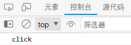

### 二、Event对象方法

* **Event.preventDefault()**
* **Event.stopPropagation()**

#### 1、Event.preventDefault()

**作用：取消浏览器对当前事件的默认行为
（比如点击链接后会默认跳转，使用后就不会跳转了）**

```html
<a href="https://www.baidu.com" id="it">百度</a>
  <script>
    var it = document.getElementById("it");
    it.onclick = function(e){
      e.preventDefault();
      console.log("点击了");
    }
  </script>
```

#### 2、Event.stopPropagation()

**作用：阻止事件在DOM中继续传播，防止再触发定义在别的节点上的监听函数，但是不包括在当前节点上其他的时间监听函数**

```html
  <div class="root">
    <div class="box"></div>
  </div>
  <script>
    var root = document.getElementsByClassName("root")[0];
    var box = document.getElementsByClassName("box")[0];

    root.onclick = function(){
      console.log("root");
    }
    box.onclick = function(){
      console.log("box");
    }
  </script>
```

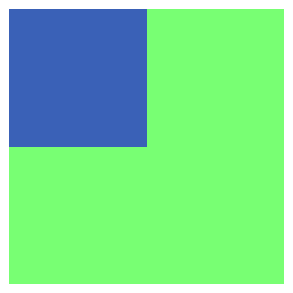（root是绿色，box是蓝色）

点击绿色会触发：

点击蓝色会触发：*（父级元素也会触发）*

**此时，就可以用Event.stopPropagation()来解决同时触发的问题**

```html
  <script>
    var box = document.getElementsByClassName("box")[0];
    box.onclick = function(e){
      e.stopPropagation();
      console.log("box");
    }
  </script>
```


## 事件类型之键盘事件

* **keydown**
* **keypress**
* **keyup**


### 一、keydown

```html
  <input type="text" id="username">
  <script>
    var username = document.getElementById("username");
    username.onkeydown = function(){
      console.log("hh");
    }
  </script>
```


### 二、keyup

**举例：获取输入对象**

```html
  <input type="text" id="username">
  <script>
    var username = document.getElementById("username");
      username.onkeyup = function(e){
        console.log(e.target.value);
      }
  </script>
```

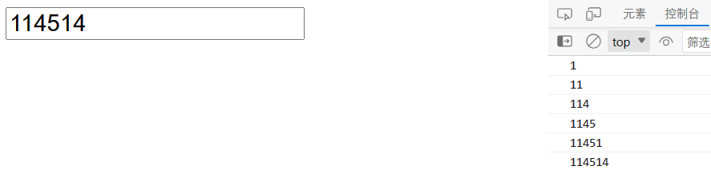

### 三、keypress（使用率较低）

**跟keydown的使用方法一样，但是无法检测Shift、Ctrl、Enter…只能检测字母、字符、数字。**

### 四、event对象

keyCode：唯一标识（就是对应的ASCII码）

```html
  <input type="text" id="username">
  <script>
    var username = document.getElementById("username");
      username.onkeyup = function(e){
        console.log(e.keyCode);
      }
  </script>
```

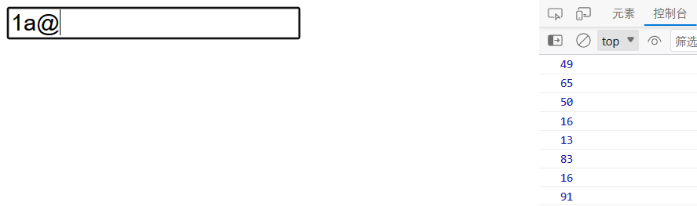

（返回这么多因为我还按了回车、shift）

```html
  <script>
    var username = document.getElementById("username");
      username.onkeyup = function(e){
        if(e.keyCode == 13){
	    console.log("开始搜索");
	}
      }
  </script>
```


## 事件类型之表单事件

**表单事件是在使用表单元素及输入框元素可以监听的一系列事件**


### 一、input事件


```html
  <input type="text" id="username">
  <script>
    var username = document.getElementById("username");
    username.oninput = function(e){
      console.log(e.target.value);
    }
  </script>
```


### 二、select事件

**在 `<input>`、`<textarea>`里面选中文本时触发**

**（要打印的话其实不是打印选中内容而是输入框内容，代码类似）**


### 三、Change事件


**就比如你写完，点一下搜索框外或者点回车就会触发，代码类似**

### 四、reset、submit事件


#### 1、reset

```html
  <form id="my">
    <input type="text">
    <button id="btn">重置</button>
    <script>
      var btn = document.getElementById("btn");
      var my = document.getElementById("my")
      btn.onclick = function(){
        my.reset();
      }
    </script>
  </form>
```


输入后点击重置可以清空表单

#### 2、submit

```html
  <form action="服务器地址" id="my" onsubmit="sub">
    <input type="text" name="username"> 
    <button id="btn">提交</button>
  </form>
  <script>
    // var btn = document.getElementById("btn");
    var my = document.getElementById("my")

    function sub(){
      console.log("");
    }
  </script>
```

**比如我在表单里输入zsw，就会出现这样一行后缀**


**会提交给action中的服务器地址（看代码）**

## 事件代理（事件委托）

**简介：点击子元素，会触发父元素事件的特性，就可以不需要每一个子元素都添加一遍事件**

```html
<ul id="list">
    <li>列表1</li>
    <li>列表2</li>
    <li>列表3</li>
    <li>列表4</li>
  </ul>
```

举个例子：
点击 li 标签可以等同于点击了 ul 标签，如果设置点击 ul 标签时打印：确认，那么在点击 li 标签时也会打印“确认”

## 定时器之setTimeout()

作用：指定某个函数或者某段代码，在多少毫秒后执行，并返回一个整数，表示定时器的编号

### 一、语法

```js
var timerId = setTimeout(func|code,delay);
```

### 二、使用

```js
    setTimeout(function(){
      console.log("大家好！");
    },3000)
```

### 三、取消定时器

```js
    var timer = setTimeout(function(){
      console.log("大家好！");
    },3000)
    //取消定时器
    clearTimeout(timer)
```

## 定时器之setInterval()

**用法和setTimeout完全一致，但它的作用是每间隔一段时间执行一次**

### 一、用法

```html
<div id="a"></div>
  <script>
    var div = document.getElementById("a");
    var opacity = 1;
    var fade = setInterval(function(){
      opacity-=0.1
      div.style.opacity = opacity
    },100)
  </script>
```

可以实现div颜色逐渐透明

### 二、取消

```js
clearInterval()
```

### 命令行工具

**常用的命令行工具：**

* **CMD**
* **PowerShell**

#### 一、CMD用法


#### 二、PowerShell用法


## ES6新增

### Let命令


#### 一、let与var的区别

**var：函数级的作用域**

用var关键字定义的变量在整个函数里都可以调用

**let：花括号级的作用域**

1.定义的变量只能在花括号里面调用

```js
for(let i=0;i<10;i++){

}
```

2.不存在变量提升（变量不能先调用后创建）

3.不能重复声明

举例：

```js
let i = 1;
let i = 2;
```

```js
let i = 1;
var i = 2;
```

都是会报错的！

### Const命令

就是声明一个常量

```JS
const PI = 3.1415
```

#### 一、特点

1、生效的作用域和let一样，是花括号级的作用域

2、也不能变量提升

3、用const创建的变量不能再次创建

### 对象的解构赋值

#### 一、作用

我们一般创建一个对象比如

```js
var user = {
	name:"iwen"
	age:20
}
```

在调用里面的变量（函数）时，总要user.name，user.age，写起来很麻烦

```js
const {name,age} = user;
```

我们可以通过这种方式，使我们在调用时不需要写user.

最常用的是

```js
const{ log } = console
```

这样在以后调用log的时候就不用写console.了

### 字符串的扩展

#### 一、字符串Unicode表示法

ES6支持Unicode

比方说 `console.log("\u0061")`会打印"a"

#### 二、字符串遍历器接口

`for...of`循环遍历

```js
for (let i of 'baidu'){
	console.log(i);
}
```

#### 三、模板字符串

```js
var baidu = `<a href="${变量}"></a>`
```

可以通过``创建变量，然后用${}在字符串里面插入变量

### 字符串新增方法

#### 一、includes()，startsWith()，endsWith()


例：

```js
console.log(allStr.includes("114514"))
```

#### 二、repeat

比如我要创建一个字符串为"xxx"

我可以

```js
var x = "x"
var str = x.repeat(3)
```

### 扩展运算符

#### 一、...

在数组前加上...可以将数组转换成一个参数序列


#### 二、作用

**打印合并后的数组时可以不用concat函数**


也可以代替apply函数，将数组转换math对象能处理的数字类型

```js
Math.max(...[1,2,3])
```

### 数组新增方法

#### 一、Array.from()

用于将类数组转换为真正的数组。

类数组（伪数组）：只能使用数组的读取方法和length属性，不能使用数组方法


##### 一、arguments

可以获取函数参数


##### 二、元素集合


**显示：**


##### 三、类似数组的对象


**显示：**


#### 二、Array.from()的使用

Array.from()可以将伪数组转换成数组

**举例：**

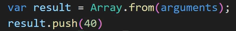


#### 三、Array.of()

作用：将一组值转换成数组

```js
Array.of(3,11,8) //[3,11,8]
```

### 对象的扩展

#### 一、属性的简洁表示法


#### 二、属性名表达式

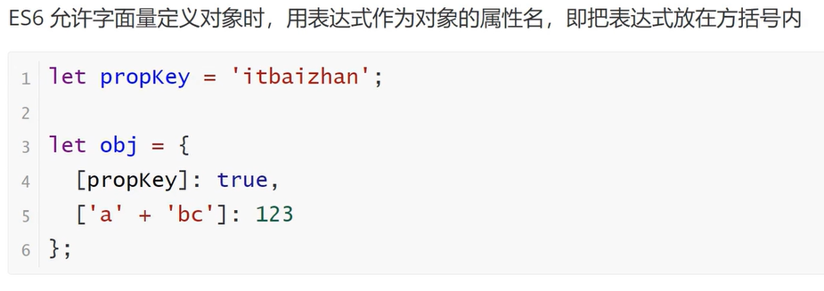

### 函数的扩展_箭头函数

#### 一、函数的声明方式

**方法一：**

```js
function fn1(){
}
```

**方法二：**

```js
var fn2 = function(){
}
```

**方法三：**


#### 二、实际应用场景

将匿名函数（未命名的函数）改写成箭头函数


#### 三、注意事项

在箭头函数中使用this，指向的上一级中的对象this指向的对象

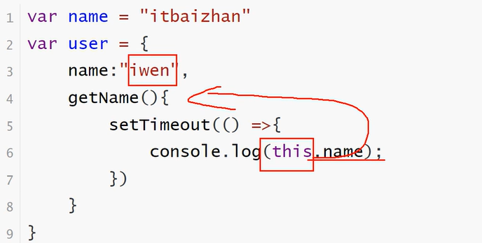

### Set数据结构

类似于数组，但是成员唯一，没有重复值

#### 一、创建set

需要使用**new**关键字创建

```js
var s = new Set();
```

#### 二、作用

set里面可以塞数组，可以实现数组去重

```js
var arr = [1,2,3,4,4,5]
console.log([...new Set(arr)])  //[1,2,3,4,5]
```

也可以实现字符串去重

```js
[...new Set('abbacd')].join('')  //'abcd'
```

#### 三、特点


### Set数据结构方法

#### 一、增：add()

#### 二、删：delete()

删除某个值，返回一个布尔值，表示是否删除

#### 三、查：has()

返回一个布尔值，表示该值是否为Set成员

#### 四、清空：clear()

清空所有成员，没有返回值

### Promise对象

#### 一、概念


#### 二、用法

用**new**关键字创建

```js
const promise = new Promise(function(resolve,reject){
	//...some code

	if(/*异步操作成功*/){
	resolve(value);
	}
	else{
	reject(error)
	}
})
```


#### 四、图片加载例子

```html
<div id="box"></div>
  <script>
    var box = document.getElementById("box")
    function loadImageAsync(url){
      const promise = new Promise(function(resolve,reject){
          //异步处理：消耗时间的代码
          const image = new Image();
          image.src = url;
          image.onload = function(){
            resolve(image)
          }
          image.onerror = function(){
            reject(new Error('无法获取图片'))
          }
      })
      return promise;
    }
    const promise = loadImageAsync("http://iwenwiki.com/api/musicimg/2.png");
    promise.then(function(data){
      //成功
      box.appendChild(data)
    },function(error){
      //失败
      box.innerHTML = "图片加载失败"
      console.log(error);
    })
  </script>
```

### Async函数

#### 一、使用

作用：使异步操作更加方便，可以将异步操作变为同步操作


看不明白，反正加个async加个await就可以让具有异步操作的timeout执行完了在执行后续代码

### Class的基本语法

#### 一、constructor方法


#### 二、类的实例


### 三、注意点

类不存在变量提升

### Class属性与方法

#### 一、实例方法

通过类的实例对象调用方法

```js
class People{
	say(){
		console.log("Hello");
	}
}
var p = new People();
p.say()
```

#### 二、实例属性

```js
    class Person{
      constructor(name,age){
        this.name = name;
        this.age = age;
      }
      say(){
        console.log((this,name,this.age));
      }
    }
    var p = new Person("iwen",20);
    p.say();
    console.log(p.name,o.age);
```

#### 三、静态方法（无法被实例调用）

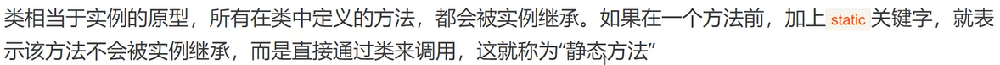

```js
    class Person{
      static classMethod(){
        console.log(("hello"));
      }
    }

    Person.classMethod()
```

**注意：**

静态方法中使用this指向的**是类而不是实例对象**

#### 四、静态属性

```js
Person.age = 30;
console.log(Person.age)
```

可直接在类外赋值

### Module语法

**作用：用于管理不同js文件之间的关系**

（因为在html中同时调用a.js和b.js后，a和b里面的变量是可以互相调用的，这就导致当js文件数目多了之后，容易产生冲突）


#### 一、export命令

**（一）导出变量**

```js
export var firstName = 'sxt';
export var lastName = 'baidu';
export var year = 200;
```

**（二）导出函数**

```js
export function add(x,y){
	return x + y;
}
```

#### 二、import命令

```js
import {变量1,变量2,函数名1,……} from "./a.js"
```

如果想给变量重新取个名字可以使用**as**关键字

```js
import {value as val} from './value.js'
```

当我们需要导入另一个js文件里所有的导出内容时，可以使用*****，把变量和函数当做**对象**使用：

```js
import * as Myhello form "./hello.js"
Myhello.getName();
console.log(Myhello.name);
```

#### 三、export default命令


**在a.js中：**

```js
export default function getName(){
	console.log("hahah");
}
```

**在b.js中：**

```js
import hhh from "./hello.js"
hhh() //hahah
```

hhh是我们随便命名的，这就是可以在**不知道函数名getName时**，使用export default的优势

**但是**，一个文件中默认只能存在一个export default

# VUE

**官网：[Vue.js | Vue.js (vuejs.org)](https://cn.vuejs.org/partners/)**

## 一、模版语法

**作用：让页面中所有元素都可以动态处理**

### 1、文本


```html
<span>Message:{{ msg }}</span>
```

一般配合**js**中的**data()**设置数据

```html
<p>{{ message }}</p>
```

```js
export default {
  name: 'HelloWorld',
  data(){
    return{
      message:"学习VUE"
    }
  }
}
```

### 2、原始HTML


**{{ }}**和**v-html**的区别可以理解为**innerText**和**innerHTML**的区别

```html
    <p>{{ rawHtml }}</p>
    <div v-html="rawHtml"></div>
```

```js
export default {
  name: 'HelloWorld',
  data(){
    return{
      message:"学习VUE",
      rawHtml:"<a href='http://www.baidu.com'>百度</a>"
    }
  }
}
```


### 3、属性Attribute


```html
<div v-bind:id="text"></div>
```

```js
export default {
  name: 'HelloWorld',
  data(){
    return{
      text:1001
    }
  }
}
```

这样，我们就可以动态修改id了

**注：**`v-bind:`可以简写成 `:`

```html
<div :id="text"></div>
```

### 4、使用JS表达式


举例（只能是单个式子）：

```html
  <p>{{ num+10 }}</p>
  <p>{{ num ? 'hh' : 'xx'}}</p>
```

```js
export default {
  name: 'HelloWorld',
  data(){
    return{
      text:1001,
      num:10
    }
  }
}
```


## 条件渲染

### 一、v-if


```html
<p v-if="flag">你好</p>
```

```js
data(){
	return{
		flag:true
	}
}
```


### 二、v-else


```html
  <p v-if="flag">你好世界</p>
  <p v-else>世界你好</p>
```

```js
export default {
  name: 'HelloWorld',
  data(){
    return{
      flag:false
    }
  }
}
```


### 三、v-show


```html
<p v-show="flag">世界你好</p>
```

**条件为真时显示，否则不显示**

### 四、v-if和v-show的区别


v-show的元素**依然会出现在控制台**，只是**css属性(display:none)**的改变，而v-if**只会留下条件为真**的元素

## 列表渲染

### 一、v-for


```html
  <ul>
    <li v-for="item in newsList">
      {{ item.title }}
    </li>
  </ul>
```

```js
export default {
  name: 'HelloWorld',
  data(){
    return{
      newsList:[
        {
          id:1001,
          title:"新闻1"
        },
        {
          id:1002,
          title:"新闻2"
        },
        {
          id:1003,
          title:"新闻3"
        }
      ]
    }
  }
}
```


### 二、维护状态


**加上一个key后，性能会好很多，可以避免重复渲染**

## 事件处理

### 一、监听事件


```html
<button v-on:click="counter += 1">按钮{{ counter }}</button>
```

也可以写成：

```html
<button @click="counter += 1">按钮{{ counter }}</button>
```

```js
export default {
  name: 'HelloWorld',
  data(){
    return{
      counter:1
    }
  }
}
```


### 二、事件处理方法


```html
    <button @click="clickHandle">按钮</button>
```

```js
export default {
  methods:{
      clickHandle(){
        console.log("hhh")
      }
  }
}
```

### 三、内敛处理器中的方法(就是可以传递参数)

```html
  <button @click="say('hi')">sai hi</button>
  <button @click="say('what')">sai what</button>
```

```js
export default {
  methods:{
      say(data){
        console.log(data)
      }
  }
}
```


## 表单输入绑定

### 一、使用

**可以使用 `<v-model>`去监听用户输入输出的更新**

```html
  <input type="text" v-model="username">
  <p>{{ username }}</p>
```

```js
export default {
  data(){
    return{
      username:""
    }
  }
}
```

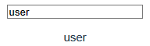**输入框中一边输入，底下会一边显示**

**示例2：**

```html
  <input type="text" v-model="username">
  <p>{{ username }}</p>
  <button @click="printname(username)">提交</button>
```

```js
export default {
  data(){
    return{
      username:""
    }
  },
  methods:{
    printname(){
      console.log(this.username);
    }
  }
}
```

**（点击提交按钮后，控制台中就会显示）**

### 二、修饰符

#### 1、.lazy

```html
<input type="text" v-model.lazy="username">
<p>{{ username }}</p>
```

**就比如这里加了.lazy之后，就不会同步更新输入，而是要等到回车之后才会显示，这是一种节约性能的做法**

#### 2、.trim

**可以自动忽略用户输入首尾的空格**

## 组建基础

### 一、单文件组件

**vue文件可以将html、css、js封装在单个vue文件中**


### 二、加载组件

**组件之间是互相引用的关系**

1. **引入组件**
2. **挂载组件**
3. **显示组件**

#### 步骤：

**1、引入、挂载**


**2、显示（以标签的形式放入html中）**


### 三、scoped

在 `<style>`标签中添加**scoped**表示**样式只在当前组件中生效**

### 四、组件的组织


## Props组件交互

### 一、使用

**在app.vue中：**


**在my.vue中：(default相当于一个默认值，用于应对没有数据传过来的情况)**


**页面：**

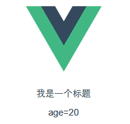

### 二、Prop类型


**数组和对象类型必须使用函数型返回**

```js
export default{
    name:"my",
    props:{
        names:{
		type:Array,
		default:function(){
			return []
		}
	}
    }
}
```

## 自定义事件组件交互


**（从子组件传递数据到父级组件）**

### 一、子组件


### 二、父组件


## 组件的生命周期


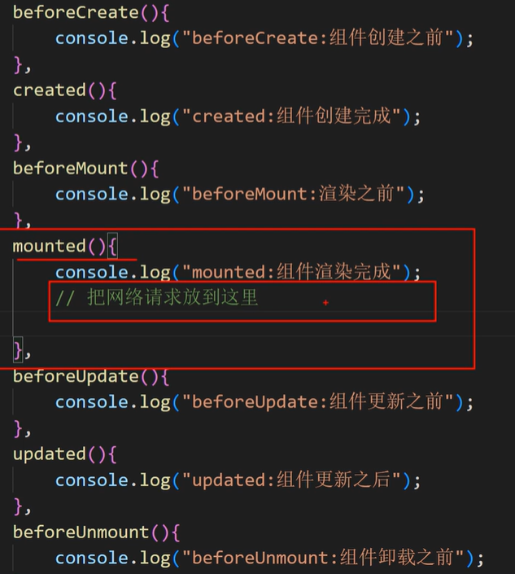


## VUE引入第三方

### 一、以引入swiper（轮播图）为例

打开终端：


输入：

`cnpm install --save swiper`（默认安装最新版）

安装后可在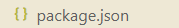中查看

### 二、使用swiper

引入swiper：

```html
<script>
import{Swiper,SwiperSlide} from 'swiper/vue';
import{Pagination} from 'swiper';
import 'swiper/css';
import 'swiper/css/pagination'; 

export default{
    name:'hello',
    data(){
      return{
        modules:[Pagination]
      }
    },
    components:{
      Swiper,
      SwiperSlide,
    }
}
</script>
```

添加可滑动的图片：

```html
<template>
  <div>
    <Swiper :modules="modules" :pagination="{clickable : true}">
      <SwiperSlide>
        
      </SwiperSlide>
      <SwiperSlide>
        
      </SwiperSlide>
      <SwiperSlide>
        
      </SwiperSlide>
    </Swiper>
  </div>
</template>
```

效果：


## Axios网络请求

### 一、安装

在终端输入 `cnpm install --save axios`

### 二、引入

1、组件引入：
`import axios from "axios"`

2、全局引入：

```js
import axios from "axios"
const app = createApp(App);
app.config.globalProperties.$axios = axios
app.mount('#app')
//在组件中调用
this.$axios
```

### 三、网络请求基本示例(组件引入)

#### get请求

```html
<template>
</template>

<script>
import axios from "axios"

export default{
    name:'hello',
    mounted(){
      axios({
        mounted:'get',
        url:"https://iwenwiki.com/api/blueberrypai/getChengpinDetails.php"
      }).then(res =>{
        console.log(res.data);
      })
  }
}
</script>
```


如果想显示在页面上：

```html
<template>
  <div>
    <p>{{ chengpin.title }}</p>
  </div>
</template>

<script>
import axios from "axios"

export default{
    name:'hello',
    data(){
      return{
        chengpin:{}
      }
    }, 
    mounted(){
      axios({
        mounted:'get',
        url:"https://iwenwiki.com/api/blueberrypai/getChengpinDetails.php"
      }).then(res =>{
        // console.log(res.data);
        this.chengpin = res.data.chengpinDetails[0];
      })
  }
}
```


#### 快捷get请求

```js
import axios from "axios"

export default{
  mounted(){
    axios.get("http://iwenwiki.com/api/blueberrypai/getChengpinDetails.php")
    .then(res=>{
      console.log(res.data);
    })
  }
}
```

### 四、全局引入

找到，添加代码：

```js
import axios from "axios"
const app = createApp(App)
app.config.globalProperties.$axios = axios
app.mount('#app')
```

效果：


```js
export default{
    name:'hello',
  mounted(){
    this.$axios.get("http://iwenwiki.com/api/blueberrypai/getChengpinDetails.php")
    .then(res=>{
      console.log(res.data);
    })
  }
}
```

## Axios网络请求封装

**作用：**

在日常应用过程中，一个项目中的网络请求会很多，此时一般采取的方案是将网络请求封装起来

需要创建一个新的文件夹，用于对请求进行相关操作：


```js
import axios from "axios"
import querystring from "querystring"

const instance = axios.create({
    // 网络请求的公共配置
    timeout: 10000,  // 网络请求的时间不能超过10秒
})

const errorHandler = (status, info) => {
    switch (status) {
        case 400:
            console.log("语义有误");
            break;
        case 401:
            console.log("服务器认证失败");
            break;
        case 403:
            console.log("服务器拒绝访问");
            break;
        case 404:
            console.log("地址错误");
            break;
        case 500:
            console.log("服务器遇到意外");
            break;
        case 502:
            console.log("服务器无响应");
            break;
        default:
            console.log(info);
            break;
    }
}

// 发送数据之前的拦截器
instance.interceptors.request.use(
    config => {
        if (config.method === "post") {
            config.data = querystring.stringify(config.data)
        }
        return config;
    },
    error => {
        return Promise.reject(error)
    }
)

// 获取数据之前的拦截器
instance.interceptors.response.use(
    response => {
        // 这里可以根据实际需要进行状态码的判断和处理
        if (response.status >= 200 && response.status < 300) {
            return Promise.resolve(response)
        } else {
            return Promise.reject(response)
        }
    },
    error => {
        const { response } = error;
        errorHandler(response.status, response.info);
        return Promise.reject(error);
    }
)

export default instance;
```

还需要创建一个api文件夹，里面创建两个js文件


Path.js：

```js
const base={
    baseUrl: "http://iwenwiki.com",
    chengpin:"/api/blueberrypai/getChengpinDetails.php"
}

export default base;
```

index.js：

```js
import axios from "../request/request";
import path from "./path";

const api ={
    //成品详情地址
    getChengpin(){
        return axios.get(path.baseUrl + path.chengpin)
    }
}
export default api 
```

在中添加一些代码

```html
<script>
import api from "../api"
export default{
  name:'hello',
  props:{
    msg:String
  },
  mounted(){
    api.getChengpin().then(res=>{
      console.log(res.data);
    })
  }
}
</script>
```


就可以获取到数据

## 网络请求跨域解决方案

1、后台解决：cors

2、前台解决：proxy

### 一、前台解决

把以下代码添加到这个文件中，

```js
devServer:{
	proxy: {
		'/api':{
		target:'<ur1>',
		changeorigin: true
		}
	}
}
```

唯一需要修改的就是 `<url>`


## Vue引入路由配置

在Vue中，可以通过 `<vue-router>`路由管理页面之间的关系

### 一、在Vue使用路由

第一步：安装路由 `npm install --save vue-router`

第二步：配置独立的路由文件

创建一个文件夹，里面创建index.js文件

```js
import {createRouter,createWebHashHistory} from 'vue-router'
import HomeView from '../views/HomeView'
import AboutView from '../views/AboutView'
//配置信息

const routes = [
    {
        path: '/',
        component:HomeView
    },
    {
        path: '/about',
        component:AboutView
    }
]


const router = createRouter({
    history:createWebHashHistory(),
    routes
})

export default router;
```

第三步：在main.js里面添加以下代码

```js
import router from './router'
createApp(App).use(router).mount('#app')
```

第四步：在App.vue里添加以下代码

```js
  <sb>这行代码没用</sb>
  <router-link to="/">首页</router-link>
  <router-link to="/about">关于</router-link>
  <router-view></router-view>
```

第五步：创建一个views文件夹，里面创建两个vue文件


最终效果：


### 二、注意


## 嵌套路由配置

TIP：在创建vue界面时勾选route后，一切变的豁然开朗~

### 一、嵌套方法

#### 第一步

就比如我要在About底下嵌套两个选项用于跳转，


redirect是用来重定向的，就是我一点about，第一个显示的就是us这个选项的内容

#### 第二步

创建 us.vue 和 info.vue,内容如下


#### 第三步

打开AboutView.vue，加上这些代码


### 二、最终效果


## VUE状态管理（Vuex）

Vuex说白了就是提供组件之间数据传输的方式。

没有Vuex传数据就只能子父级之间传，如果相差很多级传输局还要一个一个传下去，很麻烦。

有了Vuex，大家都把数据交给Vuex，然后Vuex再把数据点对点交给组件，方便了很多。

### 一、使用Vuex

一、安装Vuex： `cnpm install --save vuex`

二、创建一个store文件夹，里面创建一个index.js


三、在main.js中加入


四、调用Vuex中的变量：所有组件都可以调用！

方法一：$符号调用


方法二：导入mapState调用


## Vuex状态管理核心

最常用的核心概念包括：State、Getter、Mutation、Action

### 一、Getter

对Vuex中的数据进行过滤


### 二、Mutation


就是可以自己写一个函数


然后在组件里调用


注意要在 `<script>`标签里添加才能调用

### 三、Action


