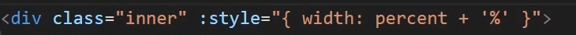

# 创建VUE实例

## 一、方法简介

**创建方法：**

1、准备容器（Vue所管理的范围）
2、引入包（开发版本 / 生产版本）-->去官网找
3、创建实例
4、添加配置项

**官网网址：**

Vue2官网：`https://v2.cn.vuejs.org/`
Vue3官网：`https://cn.vuejs.org/`

## 二、具体操作

### 1、创建容器

```html
    <div id="app">
        {{ msg }}
    </div>
```

### 2、引入包

```html
    <script src="https://cdn.jsdelivr.net/npm/vue@2.7.14/dist/vue.js"></script>
```

### 3、创建实例

```html
    <div id="app">
        {{ msg }}
    </div>
```

### 4、添加配置项

```html
    <script>
        const app = new Vue({
        //通过el配置选择器
        el:"#app",
        //通过data提供数据
        data:{  
            msg:"Hello world"
        }
     })
    </script>
```

### 5、最终效果


# 插值表达式}

## 一、作用

**利用表达式进行插值渲染到页面中**

表达式：可以计算出结果的代码

## 二、语法

**{{ 表达式 }}**

```html
<h3>([ title ]}</h3>
<p>{[ nickname.toUpperCase() </p>
<p>{{ age >= 18 ?成年 : 未成年 ]J</p>
<p>{[ obj.name }}</p>
```

## **三、注意点**

(1)使用的数据必须存在 (data)中声明
(2)支持的是表达式，而非语句，比如:if for ...
(3)不能在标签属性中使用{}插值
    **比如：**

```html
<p title="{[ username }}">我是p标签</p>
```

# Vue响应式特性

# 一、响应式

数据改变，视图自动更新

## 二、修改数据

data中的数据，最终会被添加到实例上

①访问数据："实例.属性名"
②修改数据："实例.属性名" = "值"


页面上也会自动修改

# Vue指令

**Vue会根据不同的指令，针对标签实现不同的功能**

指令：带有 `v-` 的特殊**标签属性**

## 一、v-html

**作用：设置元素的innerHTML**
**语法：v-html="表达式"**

**插值表达式{{ }}没法解析标签：**

```html
    <div id="app">
        {{ msg }}
    </div>
      	data:{  
            msg:'<a href="www.baidu.com">百度</a>'
        }
```


但改成：

```html
    <div id="app">
        <div v-html="msg"></div>
    </div>
```

就可以正常解析

## 二、v-show & v-if

### 1、v-show

**作用：控制元素的显示和隐藏
语法：v-show = "表达式"，表达式值true 显示，false隐藏
原理：切换display:none控制隐藏
场景：频繁切换显示隐藏的场景（鼠标移上去显示，移开消失这种）**

### 2、v-if

**作用：控制元素的显示和隐藏（条件渲染）
语法：v-if = "表达式" ，表达式值true 显示，false隐藏
原理：基于条件判断，是否创建或移除元素
场景：要么显示，要么移除，不频繁的场景**

比方说这种：

### 3、使用

```html
    <div id="app">
        <div v-show="flag" class="box">我是v-show控制的盒子</div>
        <div v-if="flag" class="box">我是v-if控制的盒子</div>
    </div>
```

```html
    <script>
        const app = new Vue({
        //通过el配置选择器
        el:"#app",
        //通过data提供数据
        data:{  
            flag:true
        }
     })
    </script>
```


flag 为 false 时就页面上就啥也不会显示

### 4、区别

**为true的时候：**


**为false的时候：**


**v-show是把样式改为none，
但v-if是直接让这个容器被注释掉**

## 三、v-else & v-else-if

**作用：辅助 v-if 进行判断渲染
语法：v-else v-else-if = "表达式"
注意：需要紧挨着v-if使用**

### 1、使用

```html
    <div id="app">
        <p v-if="gender === 1">性别：♂ 男</p>
        <p v-else>性别：♀ 女</p>
        <hr>
        <p v-if="score >= 90">A</p>
        <p v-else-if="score >= 80">B</p>
        <p v-else-if="score >= 70">C</p>
        <p v-else-if="score >= 60">D</p>
        <p v-else-if="score >= 0">E</p>
    </div>
```

```html
    <script>
        const app = new Vue({
        //通过el配置选择器
        el:"#app",
        //通过data提供数据
        data:{  
            gender:1,
            score:80
        }
     })
    </script>
```


## 四、v-on

**作用：注册事件
语法：
①v-on:事件名 = "内联语句"**

```html
<button v-on:click="count++">按钮</button>
```

**②v-on:事件名 = "methods中的函数名"**

### 1、使用①

```html
    <button v-on:click="count--">-</button>
    <span>{{ count }}</span>
    <button @click="count++">+</button>//v-on:可以替换成@
```

```html
    <script>
        const app = new Vue({
        el:"#app",
        //通过data提供数据
        data:{  
            count:100
        }
     })
    </script>
```


### 2、使用②

```html
        <button @click="fn">切换显示隐藏</button>
        <h1 v-show="isshow">你好</h1>
```

```html
    <script>
        const app = new Vue({
        //通过el配置选择器
        el:"#app",
        //通过data提供数据
        data:{  
            isshow:true
        },
        methods:{
            fn () {
                app.isshow = !app.isshow;
             }
        }
     })
    </script>
```

（点击按钮可以切换“你好”的显示与消失）

#### this

**作用：让提供的所有methods中的函数，this都指向当前实例**

```html
    <script>
        const app = new Vue({
        el:"#app",
        data:{  
            isshow:true
        },
        methods:{
            fn () {
                app.isshow = !app.isshow;
             }
        }
     })
    </script>
```

**比如说这里，如果把const app改成app2，**

**里面的app.isshow 就要改成 app2.isshow，**

**如果有很多个app.变量，就要改很多地方，**

**为了避免麻烦，就可以统一用this，比如this.isshow**

## 五、v-on调用传参

### 1、介绍

```html
<button @click="fn(参数1,参数2)">按钮</button>
```

```html
    <script>
        const app = new Vue({
        el:"#app",
        data:{  

        },
        methods:{
            fn (参数1,参数2) {
   
             }
        }
     })
    </script>
```

### 2、使用

```html
    <div id="app">
        <button @click="fn(5)">可乐 5元</button>
        <button @click="fn(10)">咖啡 10元</button>
        <p>银行卡余额为：{{ now }}</p>
    </div>
  
    <script src="https://cdn.jsdelivr.net/npm/vue@2.7.14/dist/vue.js"></script>
  
    <script>
        const app = new Vue({
        el:"#app",
        data:{  
            now:1000
        },
        methods:{
            fn (money) {
                this.now = this.now - money 
             }
        }
     })
    </script>
```


## 六、v-bind

**作用：动态设置html的标签属性 -> url src title
语法：v-bind:属性名="表达式"**

### 1、使用

```html
    
    <script>
        const app = new Vue({
        el:"#app",
        data:{  
            imgUrl: "C:/Users/PC/Desktop/笔记/vue/image/VUE/1691588114965.png"
        },
     })
    </script>
```

```html
v-bind:src="" 可以简写成 :src=""
```

## 七、v-for

**作用：基于数据循环，多次渲染整个元素**

**语法：v-for="(item,index) in 数组"
（item 每一项，index 下标）**

### 1、用法

```html
        <ul>
            <li v-for="(item,index) in list">{{ list[index] }}</li>
	    或者<li v-for="item in list">{{ item }}</li>

        </ul>
    <script>
        const app = new Vue({
        el:"#app",
        data:{  
            flag:1,
            list:['西瓜','苹果','鸭梨']
        }
     })
    </script>
```

**效果：**


### 2、v-for中的key

**作用：给元素添加的唯一标识，便于Vue进行列表项的正确排序复用**

**注意点:
1.key 的值只能是 字符串 或 数字类型
2.key的值必须具有 唯一性
3.推荐使用 id 作为 key(唯一)，不推荐使用 index 作为 key (会变化，不对应)**

## 八、v-model

**作用：给表单元素使用，双向数据绑定->可以快速 获取 或 设置 表单元素内容**

### 1、使用

```html
    <div id="app">
        账号：<input type="text" v-model="username"><br><br>
        密码：<input type="password"><br><br>
        <button>登录</button>
        <button>注册</button>
    </div>
  
    <script src="https://cdn.jsdelivr.net/npm/vue@2.7.14/dist/vue.js"></script>
  
    <script>
        const app = new Vue({
            el: '#app',
            data: {
                username:''
             }
         })
    </script>
```


**视图数据双向绑定：**

**（1）数据变化，视图自动更新
（2）视图变化，数据自动更新**

### 2、删除列表中的一个元素

```html
del(id) {
        this.list = this.list.filter((list) => list.id !== id);
	},
```

```html
<li v-for="item in list" :key="item.id">
    {{ item.word }}
    <button @click="del(item.id)">×</button>
</li>
```

### 3、创建一个列表元素

```html
<script>
submit(word) {
    const newWord = { id: this.list.length + 1, word: word };
    this.list.push(newWord);  
}
或者
              submit(){
                    this.list.push({
                    id: this.list.length+1,
                    name:this.kemu,
                    score:this.score
                    })
                }
<script>
```

# 指令修饰符

**通过 "." 指明一些指令后缀，不同后缀装了不同的处理操作 -> 简化代码**

## 一、举例


## 二、使用

### 1、按键修饰符

#### .enter

**按键回车时触发：**

```html
<input @keyup.enter="submit(word)" type="text" v-model="word">
```

加了.enter后相当于

```html
methods:{
	submit(e){
		if(e.key === 'Enter')
		{

		}
	}
}
```

### 2、v-model修饰符

#### .trim

**自动清楚首尾空格**

```html
姓名:<input type="text" v-model.trim="username">
```

#### .number

**自动将输入转换成数字**

```html
年龄:<input type="text" v-model.number="age">
```

### 3、事件修饰符

#### .stop

**阻止冒泡**

**语法：@事件名.stop**

#### .prevent

**阻止默认事件**

**语法：@事件名.prevent**

# v-bind操作class

**Vue 扩展了 v-bind 的语法，可以针对 class 类名 和 style 行内样式 进行控制。**


## 一、传对象控制


**适用场景：一个类名，来回切换**


## 二、传数组控制


**适用场景：批量添加或删除**

# v-bind操作style

**语法 :style ="样式对象"**

## 一、使用方式




# v-model 应用于其他表单元素

## 一、介绍

**输入 input:text
文本域 textarea
复选框 input:checkbox
单选框 input:radio
下拉菜单 select
...**

## 二、使用

```html
    <div id="app">
        姓名：<input type="text" v-model="name"><br><br>
        是否单身：<input type="checkbox" v-model="single"><br><br>
        性别：
        <input type="radio" name="gender" v-model="sex" value="0">男 
        <input type="radio" name="gender" v-model="sex" value="1">女<br><br>
        城市：<select v-model="city">
            <option value="1">北京</option>
            <option value="2">上海</option>
            <option value="3">广州</option>
        </select><br><br>
        自我介绍：<br>
        <textarea v-model="des"></textarea>
    </div>
    <script src="https://cdn.jsdelivr.net/npm/vue@2.7.14/dist/vue.js"></script>
    <script>
        const app = new Vue({
            el:'#app',
            data: {
                name: '',
                single:0,
                sex:3,
                city:0,
                des:""
             }
         })
    </script>
```


# 计算属性computed

## 一、介绍

**概念:基于现有的数据，计算出来的新数据。若数据变化，自动重新计算。**

**语法:声明在 computed 配置项中，一个计算属性对应一个函数使用起来和普通属性一样使用 {{ 计算属性名 }}**

## 二、使用

```html
    <div id="app">
        <table border="1" height="200" width="200">
            <tr v-for="item in list">
                <td>{{ item.name }}</td>
                <td>{{ item.num }}</td>
            </tr>
        </table>
        <p>总计：{{ total }}个</p>
    </div>

    <script src="https://cdn.jsdelivr.net/npm/vue@2.7.14/dist/vue.js"></script>
    <script>
        const app = new Vue({
            el:'#app',
            data: {
                list: [
                    {id: 1,name: '足球',num: 1},
                    {id: 2,name: '篮球',num: 2},
                    {id: 3,name: '桌球',num: 3}
                ]
             },
             computed: {
                total(){
                    let sum = this.list.reduce((sum,item)=>sum+item.num,0)
                    return sum;
                }
              }
         }) 
    </script>
```


# computed  vs methods

## 一、computed 计算属性

**作用:
封装了一段对于数据的处理，求得一个结果**

**语法:
①写在 computed 配置项中
②作为属性，直接使用 -> this.计算属性{{ 计算属性 }}**

**缓存特性 (提升性能) :
计算属性会对计算出来的结果缓存，再次使用直接读取缓存;
依赖项变化了，会自动重新计算->并再次缓存**

## 二、methods 方法

**作用:
给实例提供一个方法，调用以处理业务逻辑**

**语法:
①写在 methods 配置项中
②作为方法，需要调用 -> this.方法名()  {{ 方法名() }} @事件名="方法名"**

# 计算属性完整写法

## 一、介绍

****计算属性默认的简写，只能读取访问，不能“修改"，
如果要“修改”->需要写计算属性的完整写法****

**完整语法：**


## 二、使用

```html
 <div id="app">
        姓：<input type="text" v-model="firstname"><br>
        +<br>
        名：<input type="text" v-model="secondname"><br>
        =
        {{ Fullname }}
        <br>
        <input type="text" v-model="aftername">
        <button @click="change(aftername)">改名</button>

    </div>
    <script src="https://cdn.jsdelivr.net/npm/vue@2.7.14/dist/vue.js"></script>
    <script>
        const app = new Vue({
            el:'#app',
            data: {
                firstname: '',
                secondname:'',
                aftername:''
             },
             methods: { 
                change(aftername){
                    this.Fullname =  aftername
                }
             },
             computed: {
                Fullname:{
                    get() {
                        return this.firstname+this.secondname;
                     },
                     set(value){
                        this.firstname = value.slice(0,1);
                        this.secondname = value.slice(1);
                     }
                }
              }
         })
    </script>
```


# watch侦听器

## 一、介绍

**作用:监视数据变化，执行一些 业务逻辑 或 异步操作**

**语法:
①简单写法 简单类型数据，直接监视
②完整写法 >添加额外配置项**


## 二、使用

### 1、words为data中的变量

```html
<script>
        const app = new Vue({
            el:'#app',
            data: {
                words:"",
             },
             watch: {
                words(newValue,oldValue){
                    console.log('变化了',newValue,oldValue);
                }
             }
         })
</script>
```

**(打印出，新值和老值)**

### 2、words为data中obj对象的子属性

```html
    <script>
        const app = new Vue({
            el:'#app',
            data: {
                obj:{
                    words:''
                 }
             },
             watch: {
                'obj.words'(newValue,oldValue){
                    console.log('变化了',newValue,oldValue);
                }
             }
         })
    </script>
```

**（用法相同）**

## 三、使用网络请求获取数据

```html
    <div id="app">
        <div>
            <select>
                <option value="chinese">中文</option>
                <option value="English">英语</option>
            </select>
        </div>
        <div>
            <textarea v-model="obj.words"></textarea><br>
            <span>{{ result }}</span>
        </div>
    </div>
<script>
        const app = new Vue({
            el:'#app',
            data: {
                obj:{
                    words:''
                 },
                 result:""
             },
            watch: {
                'obj.words'(newValue,oldValue){
                clearTimeout(this.timer)
                this.timer = setTimeout(async() => {
                    const res = await axios({
                        url:'https://applet-base-api-t.itheima.net/api/translate',
                        params: { 
                            words:newValue
                        }
                    })
                    this.result = res.data.data
                 },300)
                }
             }
         })
    </script>
```

**（优化：防抖）**

# watch侦听器（监视器）

**(1) deep: true 对复杂类型深度监视（对象所有属性的变化都能监视到）
(2) immediate: true 初始化立刻执行一次handler方法（一进入页面就会执行handler方法）**

```html
<div id="app">
        <div>
            <select v-model="obj.lang">
                <option value="chinese">中文</option>
                <option value="English">英语</option>
            </select>
        </div>
        <div>
            <textarea v-model="obj.words"></textarea><br>
            <span>{{ result }}</span>
        </div>
    </div>
<script>
        const app = new Vue({
            el:'#app',
            data: {
                obj:{
                    words:'a',
                    lang:'chinese'
                 },
                 result:""
             },
            watch: {
                obj: {
                    deep:true,
                    immediate:true,
                    handler(newValue){
                    clearTimeout(this.timer)
                    this.timer = setTimeout(async() => {
                        const res = await axios({
                            url:'https://applet-base-api-t.itheima.net/api/translate',
                            params: { 
                                newValue
                            }
                        })
                        this.result = res.data.data
                    },300)
                    }
                 }
             }
         })
</script>
```


**一进入页面立刻翻译默认文本a，并且修改文本和语言也会做出相应翻译**

# 项目：购物结算界面


# Vue的生命周期和生命周期的四个阶段

**Vue生命周期：一个Vue实例从 创建 到 销毁 的整个过程**

**生命周期四个阶段：创建 挂载 更新 销毁**


# Vue生命周期函数（钩子函数）

**Vue生命周期过程中，会自动运行一些函数，被称为[生命周期钩子] 让开发者可以在[特定阶段] 运行自己的代码。**


```html
<script>
        const app = new Vue({
            el:"#app",
            data: {
                count:100
             },

            beforeCreate() {
                console.log("beforeCreate创建之前");
              },
            created() {
                console.log("created创建之后");
               },
            beforeMount() {
                console.log('beforeMount');
                },
            mounted() {
                    console.log('mounted渲染之后');
            },
            beforeUpdate() {
                console.log("更新之前");
             },
             updated() {
                console.log("更新之后");
              },
              beforeDestroy() {
                console.log("卸载之前");
               },
               Destroyed() {
                console.log("卸载之后");
                }
         })
    </script>
```

# 实战：记账本


# 脚手架目录文件介绍 & 项目运行流程


## 一、核心文件

**main.js，index.html，App.vue**

### 1、main.js

**核心作用：导入App.vue，基于App.vue创建结构渲染index.html**


**el:'#app' 和 .$mount('#app')二者选其一，都是用于指定vue所管理的容器**

**render：把App.vue的代码弄到index.html的组件里**

### 2、index.html

**作用：只需要创建组件，核心代码（html,css,js)不需要在这里编写**

### 3、App.vue

**作用：编写核心代码（html,css,js)**

# 组件化开发 & 根组件

## 一、App.vue 文件 的三个组成部分

* **template:结构**
* **script: js逻辑**
* **style: 样式(可支持less，需要装包)**

```html
<script>
export default {
  name: 'App',
  components: {
    HelloWorld
  }
}
</script>
```

**export default 可以提供data（特殊）、mothods、computed、生命周期函数……**

# 普通组件的注册使用

**组件注册的两种方式:**
1.局部注册：只能在注册的组件内使用
	①创建.vue 文件(三个组成部分)
	②在使用的组件内导入并注册
2.全局注册：所有组件内都能使用

**使用：**

当成html标签使用‘<组件名></组件名>’

## 一、局部注册


### 1、示例

**App.vue**


**如果组件名和标签名同名，可以省略组件名，像这样：**


**Header.vue（body.vue同理）**


## 二、全局注册

**特点：**
所有的组件都能使用

**方法：**
①创建.vue文件
②main.js中进行全局注册


### 1、示例

**main.js**


**Header组件**


**App.vue**


# 组件的三大组成部分 - 注意点说明

## 一、style

**全局样式（默认）：影响所有组件**

**局部样式：scoped下样式，只作用于当前组件**

### 1、scoped使用方法

```html
<style scoped>
div{

}
</style>
```

**这样就只会对当前组件内的div生效**

## 二、script

### 1、data是一个函数

一个组件的 **data** 选项必须是一个 **函数**。 

-> 保证每个组件实例，维护**独立**的一份数据对象

### 2、示例

**App.vue**


**ACount.vue:**


**每一个组件之间的count是独立的**

# 组件通信

**概念：组件之间数据传递**

## 一、组件通信解决方案


### 1、父 -> 子
