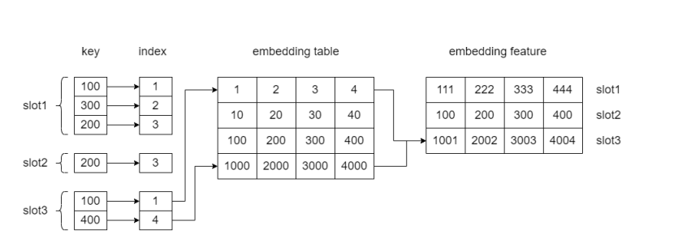

# 大创

## 编码

### 一、one-hot编码

优点：编码起来简单；

缺点：把每个词孤立起来，每两个向量的内积都是 0，使得算法对相似词的泛化能力不强（无法获取和挖掘到词之间的联系）。

### 二、Embedding编码（嵌入）

介绍：就是用一个向量表示一个 Object 的方法。

（举例用四个维度来表达每个词，当然实际中维度在 50-300 左右）

特点：求两个词的 Embedding 的相似度时候很容易也很明显

#### 1、Embedding层

作用：把稀疏的 One-hot 向量转换成稠密的 Embedding 向量

特点：每一个特征对应一个 Embedding 层，不同 Embedding 层之间互不干涉

#### 2、Stacking层

也称连接层，Concatenate 层

作用：**拼接**不同的 **Embedding 特征**和**数值型特征**

#### 3、MLP层

特点：全连接，就是不同层的神经元两两之间都有连接。

作用：让特征向量不同维度之间做充分的交叉，**让模型能够抓取到更多的非
线性特征和组合特征的信息**

#### 4、Scoring层

也被称为输出层

解释：如果是**点击率预估**，就是一个**二分类问题**，那我们就可以**采用逻辑回归作为输出层神经元**，而如果是类似图像分类这样的**多分类问题**，我们往往在**输出层采用 softmax 这样的多分类模型。**

## hugectr主要流程解释

### 一、三级流水线

介绍：DataReader 是一个由多个并行 worker 组成的组件，每个 **worker**
一次从其分配的数据集中**读取**一个 **batch 的数据**，**以及**一个将收集的数据分发给多个 GPU 的 **collector**。所有 **worker、collector 和 train** 都作为不同的线程**在CPU 上同时运行**

#### 1.1 第一级：Read File

read_a_batch（）函数循环读取 batchsize 个样本，开始解析数据，得到 sparse参数，dense 参数，label 等。把每个样本的 label 和 dense 数据从 label_dense 数组复制到 label_dense_buffers 数组，把每个样本的 sparse 参数按照 paramid, slot, nnz从 feature_ids_ 数组复制到 csr_buffers_ 容器。

#### 1.2 第二级：Copy to GPU

collect（）函数把 label_dense_buffers 和 csr_cpu_buffers 中的数据 copy 到 label_dense_buffers_internal_ 和 csr_buffers_internal_ 中。

#### 1.3 第三级：Train

read_a_batch_to_device（）函数把 csr_buffers_internal_ 复制给 csr_buffers_，接着分离 label 和 dense 数据。

嵌入层进行前向传播，即从参数服务器读取 embedding，进行处理；
对于网络层进行前向传播计算 loss 和反向传播更新参数；
嵌入层反向传播，利用网络层传来的梯度更新 embedding。

### 二、Embedding 的前向传播

