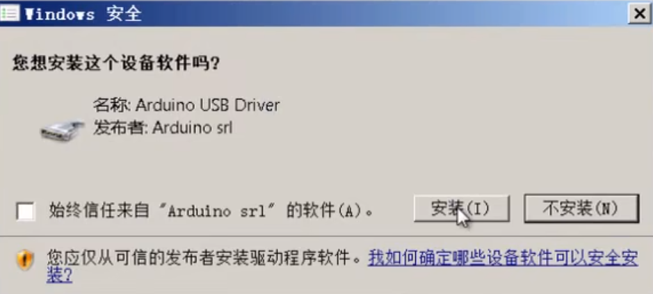
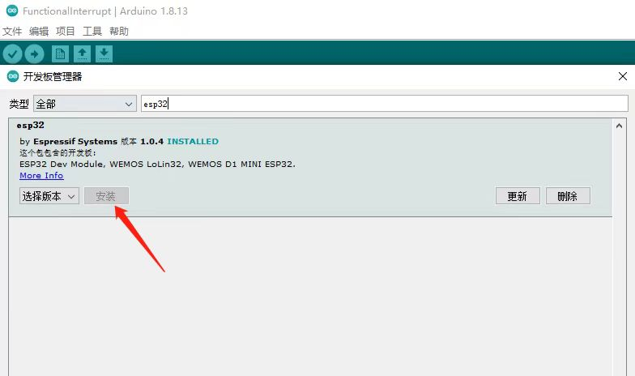

# 作者：思而行

# 时间：2023-8-8

助想搞小车但没法下手的 hxd 一臂之力，自己淋过雨，给别人把伞，多是一件美事

（我也是个菜鸡，也不比下不了手的人多知道多少，这个文档只能帮你让小车循个线，更高级的巡线算法啥的咱也帮不了，也教不了，以上。）


# Arduino下载、安装

**官网：`https://www.arduino.cc/en/software`**

或者

**百度云盘：`https://pan.baidu.com/s/1crJk7s`**

## 官网下载

### **一、进入 ：`https://www.arduino.cc/en/software`**

选择跟你电脑系统对应的下载


### 二、下载


**等待……**


## 安装

### 一、跟着选就行


### 二、这里要全选


### 三、自己想改存储路径的话可以改，建议别存C盘


### 四、这里一定要选择安装！！！



# 配置Arduino环境

## 步骤

**打开arduino**


**找到**文件->**点击**首选项


添加ESP32的管理网址：[https://dl.espressif.com/dl/package_esp32_index.json](https://dl.espressif.com/dl/package_esp32_index.json)


**找到**工具->**找到**开发板->**点击**开发板管理器


**开发板管理中，搜索esp32，如下图所示，安装Arduino core for esp32（安装不上就挂vpn，没有vpn就多安装几遍，安装不上很正常，耐心一点）**



**然后选择中对应的开发板，我们可以看到这里有很多不同的ESP32开发板，这里选择ESP32 Dev Module就可以了。**


# 让小车动起来（一）

**一切的一切，得先把小车装起来，这个自力更生**

## 导入库

**这一步是因为库里有很多有用的函数，不导入没法用**

```cpp
#include <Arduino.h>
#include <ESP32Servo.h>
```

## 定义电机引脚

**引脚**你可以理解为一个**连接点**，跟不同的**连接点**（引脚）连接就可以跟不同的东西产生联系（传输数据）

因为有四个轮子，所以有四个电机，所以有四个电机引脚


**定义引脚：**

```cpp
#define IO_M1PWM 32
#define IO_M2PWM 18
#define IO_M3PWM 33
#define IO_M4PWM 19
```

为什么这么定义呢？

**这就要看我们的原理图了**


**PWM接口**用于产生可调节的脉宽调制信号，通常用于**控制电机速度、LED亮度、音频音量**等应用场景。

别头痛，一时半会反应不过来也没关系，这个代码你都可以直接复制粘贴到Arduino里面不管他，像这样


回过头来，我们再看一看这个宏定义，

其实我们将：

```cpp
#define IO_M1PWM 32
#define IO_M2PWM 18
#define IO_M3PWM 33
#define IO_M4PWM 19
```

写成：

```cpp
#define a 32
#define b 18
#define c 33
#define d 19
```

程序都不会出错，只是为了以后看代码的时候知道32,18……这些引脚对应的是啥，才这么命名的，**比如说看到PWM就知道对应电机，看到IO_M1就知道对应哪个电机**

你现在还不知道对应哪个电机没关系，往后看就知道了

## 进一步定义电机引脚

```cpp
#define IO_M1IN1 14
#define IO_M1IN2 13
#define IO_M2IN1 17 
#define IO_M2IN2 5
#define IO_M3IN1 26
#define IO_M3IN2 27
#define IO_M4IN1 16
#define IO_M4IN2 4
```

**IN引脚**可以用于**接收**来自其他电路或控制器的**控制信号**。例如：一个**电机**可以具有一个**IN引脚**，用于接收**速度控制信号**或**启动(停止)信号**，控制**电机的转速**或**运行状态**。

**还是这两张图：**


## 定义红外线灯引脚

**在车头你可以看到4个小灯（想要灯亮记得把小车的开关打开）：**


这四个小灯的亮灭是由底下的四个红外线感应器决定的，

准确的说，如果感应器下方有黑线（反射回来的光很少），对应的小灯就会亮，反之就会灭

**又要拿出我们的原理图了！**


```cpp
//sp代表循迹小灯的引脚，从右往左，每个灯编号1,2,3,4
#define sp1 34
#define sp2 35
#define sp3 39
#define sp4 36
```

你可能会疑惑为啥这里定义的名字是sp，明明原理图里都没有出现sp

记得我们上面讲的吗：


**命什么名字不重要，只要你认得出来就行（比如说：sp = SensorPin ——>感应引脚）（你也可以命名成L1,L2,L3,L4——>Light，无所谓，都可以)**

最终代码效果：


# 让小车动起来（二）

## 初始化小灯参数（一）

```cpp
void setup(){

  //设置巡线（小灯）引脚为输入模式
  pinMode(sp1,INPUT);
  pinMode(sp2,INPUT);
  pinMode(sp3,INPUT);
  pinMode(sp4,INPUT);

}
```

**`pinMode()` 函数是用于设置特定引脚的模式，以确定该引脚的输入或输出功能。**

显而易见，pinMode(a,b)函数的第一个参数a是你所要指定的引脚，第二个参数b是你想要给这个引脚设置的状态。

* **`INPUT`：将引脚设置为输入模式，接收外部信号。**
* **`OUTPUT`：将引脚设置为输出模式，用于控制外部设备。**

我们为什么要给小灯的引脚设置为INPUT呢？

因为我们之后要根据小灯的亮灭来确定左转、右转还是直走，而前提：是要知道小灯亮灭的情况，所以就要用INPUT来接收数据，获得小灯亮和灭传来的数据。

## 初始化电机参数（二）

继续在setup()函数里加代码，这次初始化的是电机的相关参数：

```cpp
void setup(){
  pinMode(sp1,INPUT);
  pinMode(sp2,INPUT);
  pinMode(sp3,INPUT);
  pinMode(sp4,INPUT);
    // 设置电机引脚为输出模式
  pinMode(IO_M3IN1, OUTPUT);
  pinMode(IO_M3IN2, OUTPUT);
  pinMode(IO_M3PWM, OUTPUT);
  pinMode(IO_M4IN1, OUTPUT);
  pinMode(IO_M4IN2, OUTPUT);
  pinMode(IO_M4PWM, OUTPUT); 
  pinMode(IO_M1IN1, OUTPUT);
  pinMode(IO_M1IN2, OUTPUT);
  pinMode(IO_M1PWM, OUTPUT);
  pinMode(IO_M2IN1, OUTPUT);
  pinMode(IO_M2IN2, OUTPUT);
  pinMode(IO_M2PWM, OUTPUT);

}
```

为什么是output呢，因为之后你要控制轮子朝哪转，转多快，这都需要你给电机传输数据，所以是output。

## 初始化数据传输速率参数（三）

```cpp
void setup(){
  pinMode(sp1,INPUT);
  pinMode(sp2,INPUT);
  pinMode(sp3,INPUT);
  pinMode(sp4,INPUT);
    // 设置电机引脚为输出模式
  pinMode(IO_M3IN1, OUTPUT);
  pinMode(IO_M3IN2, OUTPUT);
  pinMode(IO_M3PWM, OUTPUT);
  pinMode(IO_M4IN1, OUTPUT);
  pinMode(IO_M4IN2, OUTPUT);
  pinMode(IO_M4PWM, OUTPUT); 
  pinMode(IO_M1IN1, OUTPUT);
  pinMode(IO_M1IN2, OUTPUT);
  pinMode(IO_M1PWM, OUTPUT);
  pinMode(IO_M2IN1, OUTPUT);
  pinMode(IO_M2IN2, OUTPUT);
  pinMode(IO_M2PWM, OUTPUT);
  //设定硬件与计算机之间数据传输速率
  Serial.begin(9600);
}
```

```cpp
  //设定硬件与计算机之间数据传输速率
  Serial.begin(9600);
```

因为你要给电机传输速度的数据，所以要设置一个传输数据的速度，9600波特率是一种常见的传输速率，适用于大多数应用，并且在较短距离、不强依赖实时性的情况下表现良好。

了解到这个一层面就行了。

想进一步了解的话：


**最终代码效果：**


# 让小车动起来（三）

Cheers！坚持到了这一节咱们就可以写一些能让小车动起来的代码了
